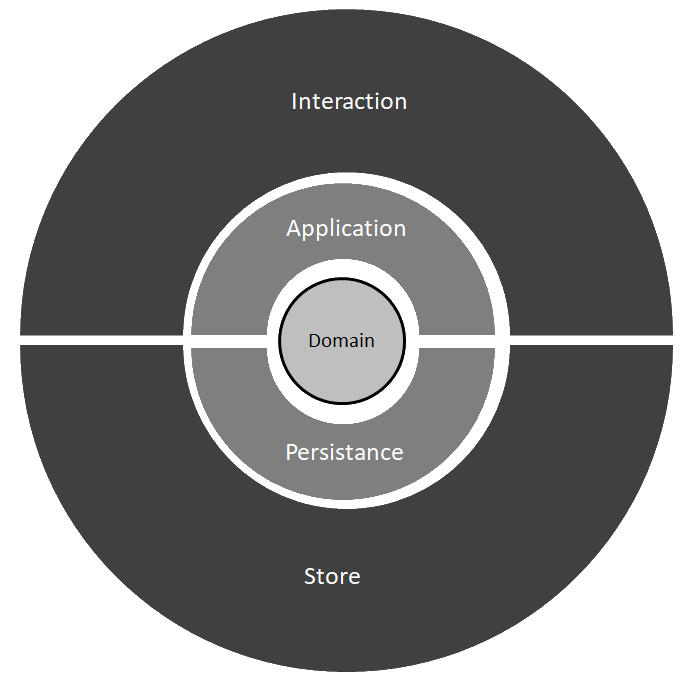

:toc:

= clean-hexa-arch example

This applications uses a https://blog.cleancoder.com/uncle-bob/2012/08/13/the-clean-architecture.html[clean] https://alistair.cockburn.us/hexagonal-architecture[hexagonal] architecture variant. 

Layers are allowed to depend only on immediate inner layers and layers on the same level (same color).

Because of this all data must the converted between layers. I created a simple framework for this in `com.github.commons.conversion`. The converters are fluent and strong typed. Also converters registry is manual, but could be automated.

We will see layer by layer, but here is a resume 

|=====
| *Layer*  		|	*Main flow object sufix*	|	*Data object sufix*
| Interaction	|	Controller (REST)			| 	 Resouces
| Application	|	ApplicationService			| 	 _none_
| Domain		|	Service						| 	 Entity
| Persistence	|	Repository					| 	 Data
| Store			|	Store						| 	 n/a 
|=====

== Interaction

This is a glue layer between Spring Rest controllers and the application layer where orchestration takes place. 

Data is modeled in Resources. More than one resource can be use for the same concept depending on what fields are needed. For example, we have `ExamResource` and `ExamWithLaboratoriesResource`. All fields inside resources are primitive data or other resources. 

The Resource model allows catering to specific client or API needs. It could be dynamic as is exemplified in the exam filter end point. Other parameters, like headers, could be used to change resources.  

The REST layer could read data directly from stores is need be (for speed) by means of gateways that return resources directly. This approach was not used in the implementation since all queries need some kind of filtering.

== Application

Contains all the orchestration logic. In this example there is no example of remote call to another system/service, but if need be the application layer would model that.

Application services are the real entry point of the application. They handle objects in the application model. Keys are modeled as Tiny Types modeled for each type. This way no keys are passed erroneously. Keys are made strong in this implementation across all layers. This means an Exam will have a `Exam::1` key and not just `1`. This can be adjusted in each layer. Keys do have to be longs. I used longs for simplicity but any type is possible (a special good type is UUID). I like working with strong keys, but a more simple mode canbe used. Also is possible to use simple ids externally and strong keys internally. 

The application layer can call repositories or services in the domain layer. It call also call repositories implementations directly from the persistence layer but normally this is not necessary.  Some systems may not have a domain layer so in that case the data is retrieved directly from the persistence layer. 

== Domain 

Contains all Domain Services, validators , entities and other objects that form the domain as intended in a Domain Drive Design model. It may not be present.  

In this example a domain layer is necessary only because there are creation endpoints. Creation demands validation and rules. In the example I did not implement validation for simplicity, but its easily implemented using the Validator pattern.  Business rules are exemplified with the control of the active flag (as required in the briefing document)

Domain also contain the repositories contracts.

The Domain define the Entity model. Entities are the objects containing data in this layer. Important to not that these are not the typical entities for JPA that annotated with `@Entity` . These Entities are real DDD, infrastructure agnostic entities.

== Persistence

Where the Repositories are implemented against a DataStore. The DataStore is an abstraction implemented in the Store layer. 

Repositories define rules for queries using a Criteria API. This API is technology independent as is the DataStore interface. This way the same queries can be translated to different technologies and do not depend on the technologies but on the rules

The criteria API I implemented here is very simple, only to exemplify and make the queries work. With more time a fluent, strong typed API is possible to implement.

The persistence layer also defines the persistence model. Persistence data are objects that only use primitive types, like Resources and are model after tables in a database. However need not correspond to tables. When using a NoSQL Datastore that supports documents a more complex data model is possible. 

== Store

This layer implements the DataStore interface according to some persistence technology. For this example I used simple memory store, but with more time other technologies can be used. Stores are versatile and independent of domain rules. 

Store use a Data model that read at the beginning of the application. The model  I implement is the basic one using annotations for simplicity. With more time a full fluent, strong typed model is possible. Strong typed fluent API guarantee the types and fields always match and do not pollute the model with annotations.

== Other Layers

=== Start

The start layer is an infrastructure layer that sits logically underneath the previous mentioned layers. 

All layer are keep without dependencies on infrastructure code like annotations. To bind layer together a set of Spring Configuration are used. These configurations declare all dependencies between types so the classes themselves don`t need to. 

This keeps the layers independent of boot and deployment technology like is commanded by clean architecture principles. 

=== Commons

Commons is also an infrastructure layer that provides common funcionaly and concepts. These are very basic implementations so the code works. Conversion and criteria API could be vastly better. I present only the basic concepts. With a full API configuration will be minimum , conversion would be automatic and queries would be more powerful.
  
= CSS Organization

CSS is organized using https://www.xfive.co/blog/itcss-scalable-maintainable-css-architecture[Inverted Triangle CSS - ITCSS], together with http://getbem.com/introduction/[BEM] and https://sass-lang.com/[Sass]

= Blinding and Running 

All command are given assuming you are in the project root directory. (the same directly this README file is on)

== Locally

The project can be build an run with maven directly. 

IMPORTANT: You need to have installed *maven* previously   

`./mvnw spring-boot:run`

Once the application is executing access the following address in your browser

`http://localhost:8080/swagger-ui`

You will have access to the API`s documentation and may try it directly from Swagger interface, although I recommend Postman for accessing the API.
 
The API contains two sets of endpoints for each entity. One set for single operations, and another for batch operations. 

== Docker 

You can run the project using docker. You will need to create an image and then run it

IMPORTANT: You need to have installed *docker* previously

Creating an image tagged `reference-node`:

`docker build -f Dockerfile -t reference-node`

Run the image binded to port `8080`
   
`docker run -p 8080:8080 reference-node .`
